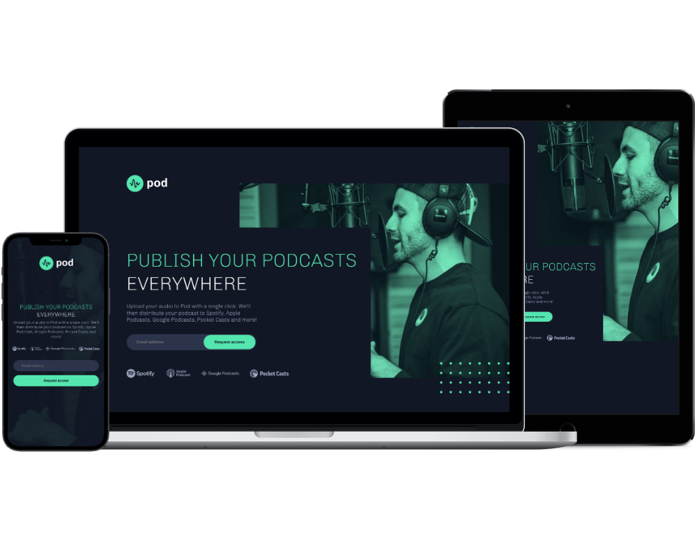

# Frontend Mentor - Pod request access landing page solution

This is a solution to the [Pod request access landing page challenge on Frontend Mentor](https://www.frontendmentor.io/challenges/pod-request-access-landing-page-eyTmdkLSG). Frontend Mentor challenges help you improve your coding skills by building realistic projects. 

## Table of contents

- [Overview](#overview)
  - [The challenge](#the-challenge)
  - [Screenshot](#screenshot)
  - [Links](#links)
- [My process](#my-process)
  - [Built with](#built-with)
  - [What I learned](#what-i-learned)
  - [Continued development](#continued-development)
  - [Useful resources](#useful-resources)
- [Author](#author)

## Overview

### The challenge

Users should be able to:

- View the optimal layout depending on their device's screen size
- See hover states for interactive elements
- Receive an error message when the form is submitted if:
  - The `Email address` field is empty should show "Oops! Please add your email"
  - The email is not formatted correctly should show "Oops! Please check your email"

### Screenshot



### Links

- Solution URL: [Github Repo](https://github.com/jmcbutter/landing-page)
- Live Site URL: [Github Pages](https://jmcbutter.github.io/landing-page/dist/index.html)

## My process

### Built with

- Semantic HTML5 markup
- CSS custom properties
- Flexbox
- SASS
- JavaScript (Client-Side Form Validation)

### What I learned

Using `<picture>` and `<source srcset="">` to improve performance and serve differently cropped images to control art direction.

```html
<picture>
  <source srcset="./assets/tablet/image-host.jpg" media="(max-width: 1200px)">
  <source srcset="./assets/mobile/image-host.jpg" media="(max-width: 700px)">
  
</picture>
```
Using psuedo-elements to control styling based on form validity.
```css
    &:not(:placeholder-shown) {
      /.../
    }

    &:invalid:not(:placeholder-shown) {
      /.../
    }

    &:invalid:focus {
      /.../
    }

    &:valid {
      /.../
    }
```

Using media-queries to create a responsive design based on screen size.

```css
@media screen and (max-width: $desktop-breakpoint) {
  /.../
}
```

### Continued development

Continue focusing on responsive design. Additionally, improve comfortability
with SASS mixins, variables, etc.

### Useful resources

- [The Odin Project](https://www.theodinproject.com/) - The lessons and links that
this site contains have helped me understand frontend web development
better than I could have on my own.
- [CSS Tricks](https://css-tricks.com/) - Conatins almost anything you want to know
about CSS, with easy-to-understand examples.

## Author

- Website - [Jordan Butterfield](https://jmbutterfield.com)
- Github - [@jmcbutter](https://github.com/jmcbutter)
- Frontend Mentor - [@jmcbutter](https://www.frontendmentor.io/profile/jmcbutter)
- LinkedIn - [Jordan Butterfield](https://www.linkedin.com/in/jordan-butterfield-933274a9/)
